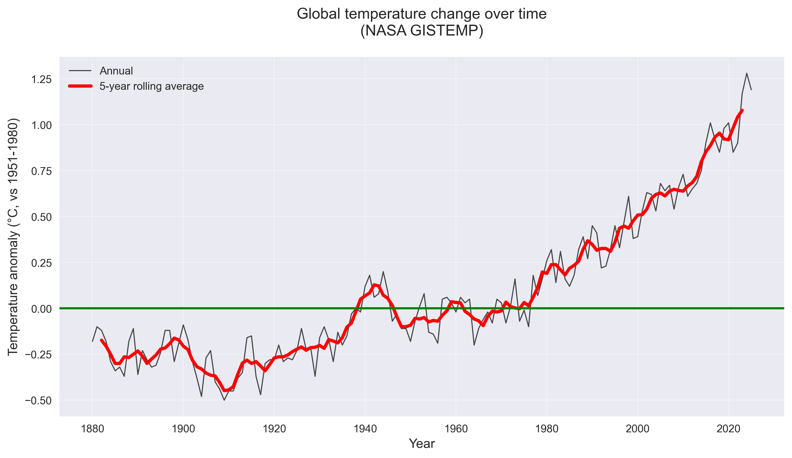

# Global Temperature Trends Analysis

**Climate mini-project**: Analysis of global surface temperature change using NASA GISTEMP data. [web:3][web:33]

## 📊 Overview

This project answers: **"How has global temperature changed over time?"**

I loaded NASA GISTEMP global land‑ocean temperature anomalies (1880–2025), cleaned the data, calculated trends, and created visualizations showing clear long‑term warming. [page:1][web:3][web:33]

## 📈 Visualizations

### 1. Temperature time series



**Annual anomalies** (black) show year‑to‑year variation. The **5‑year rolling average** (red) reveals the long‑term warming trend. The green line marks the 1951–1980 baseline. [page:1]

### 2. Warming stripes


Each vertical stripe = **one year**. **Blue** = cooler than 1951–1980 average. **Red** = warmer. The shift from blue to red shows **~140 years of warming**. [page:1][web:9]

## 🔥 Key findings

Using NASA GISTEMP v4 data (global land+ocean): [web:3][page:1]

- **Warmest year**: 2024 (+**1.28°C** above 1951–1980 baseline)
- **Coolest year**: 1909 (**−0.50°C**)
- **1880–1900 average**: **−0.23°C**
- **2015–2025 average**: **+1.01°C**
- **Total change** (1880–1900 vs recent decade): **+1.23°C** warming [page:1]

## 📋 Dataset

**NASA GISS Surface Temperature Analysis (GISTEMP v4)** [web:3][web:33]

- **Coverage**: Global land stations + ocean surface temperatures [web:3]
- **Period**: 1880–2025 [page:1]
- **Baseline**: Anomalies relative to **1951–1980** global average [web:33][page:1]
- **Units**: Degrees Celsius (°C) [page:1]
- **Source**: [GLB.Ts+dSST.txt](https://data.giss.nasa.gov/gistemp/tabledata_v4/GLB.Ts+dSST.txt) [page:1]

**What "anomaly" means**: How much warmer/cooler each year was compared to the 1951–1980 average for that time of year. Zero = same as 1951–1980 average. [web:33]

## 🛠️ Methods

**Python + Jupyter notebook** (`notebooks/climate_trends.ipynb`):

1. **Load**: Read NASA annual means CSV using pandas [page:1]
2. **Clean**: Convert to °C, remove incomplete years
3. **Smooth**: Calculate 5‑year rolling average
4. **Visualize**:
   - Time series line chart (matplotlib)
   - Warming stripes (matplotlib imshow)
5. **Analyze**: Warmest/coolest years + period comparisons

**requirements.txt** lists all packages used.

## 🔄 How to run

```bash
git clone https://github.com/Tinashe-stack/climate-trends.git
cd climate-trends

# Create virtual environment (recommended)
python -m venv .venv
source .venv/bin/activate  # Mac/Linux
# .venv\Scripts\activate    # Windows

pip install -r requirements.txt

# Run the notebook
jupyter notebook notebooks/climate_trends.ipynb

# ⚠️ Limitations
# Uses published NASA dataset – no original data collection [web:3]
# Simple analysis for educational purposes, not climate modeling
# Year‑to‑year variation is noisy; focus on long‑term trend (red line) [web:33]
# 2025 data preliminary (updated monthly by NASA) [web:3]

# 📚 Sources
# NASA GISTEMP v4 [web:3]
# GISTEMP FAQ [web:33]
# Data file: GLB.Ts+dSST.txt [page:1]


```
